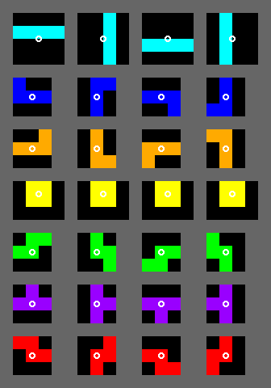

# Original Tetris (1984) — Rules & Mechanics Reference  
*Target implementation spec for **Korobeinix***

## 1 · Playfield

| Property | Value |
|----------|-------|
| **Visible grid** | **10 columns × 20 rows** |
| **Hidden rows** | 4 extra rows above the ceiling (pieces spawn here) |
| **Coordinate origin** | Top-left |
| **Spawn column** | Column 5 (6 if I count from 1) |
| **Alias** | The pit was called the **_stakan_** (“glass” in russian) by the original author |

---

## 2 · Tetromino Set

* I · J · L · O · S · T · Z  
* All monochrome (the Elektronika-60 terminal had no colour).

---

## 3 · Rotation System — *Original Rotation System (ORS)*

* Single rotation direction: **clockwise 90 °** only.  
* Each piece has a **fixed pivot block** (see diagrams below).  
* **No wall-kicks**: if rotation collides, the action is rejected.  

---

## 4 · Randomiser

* Simple call to the Pascal RNG → **independent draws**.  
* Consequence : duplicates (or triplicates) are common.  

---

## 5 · Player Actions

| Action | Details |
|--------|---------|
| **Move ← / →** | One column per keypress. |
| **Rotate** | Clockwise, ORS rules above. |
| **Gravity** | Automatic; **no soft-drop** or hard-drop keys. |
| **Locking** | The piece locks the frame it contacts floor or another block. |

---

## 6 · Speed / Level Curve

Level starts at 0.  
Gravity tick = time between automatic downward moves.

| Level | Lines cleared to reach it | Tick (≈) |
|-------|---------------------------|----------|
| 0 | – | **800 ms** |
| 1 | 10 | 500 ms |
| 2 | 20 | 400 ms |
| 3 | 30 | 350 ms |
| 4 | 40 | 300 ms |
| 5 | 50 | 250 ms |
| 6 | 60 | 200 ms |
| 7 | 70 | 150 ms |
| 8 | 80 | 120 ms |
| 9+ | 90 + | 100 ms (cap) |

---

## 7 · Scoring (original formula)

There were **no line-clear points** !  
Score rewarded the **distance fallen** before locking.
* Each 1 000 pts rolled over visually (historical quirk). 

---

## 8 · Game Over Condition

* If any part of a newly-locked piece occupies row 20 (first hidden row) → **Game Over**.

---

## 9 · Absent Features (by design)

* No **Next** preview.
* No **Hold** queue.
* No soft-/hard-drop.
* No audio (Elektronika-60 lacked sound).

---

## 10 · Fidelity Checklist for **Korobeinix**

| Must-clone faithfully | How to implement |
|-----------------------|------------------|
| ORS rotation without kicks | Write unit tests per tetromino orientation. |
| Pure RNG with duplicates | Seedable PRNG → reproducible replays. |
| Distance-based scoring | Update score on lock event, not on line clear. |
| Single invisible queue | Hide all preview UI in v1. |
| Level curve | Lookup table above, advance every 10 clears. |

| Flexible / modernise | Suggestions |
|----------------------|-------------|
| Graphics & palette | Colourful “-ix” universe, smooth CSS animations. |
| SFX / music | Optional 8-bit remake of **Korobeiniki** (public-domain melody, new arrangement). |

---
